# Database Schema - Beach Club Management System

## Entity Relationship Diagram

```mermaid
erDiagram
    %% ========================================
    %% USERS & AUTHENTICATION
    %% ========================================
    users ||--o{ roles : "has"
    roles ||--o{ role_permissions : "has"
    permissions ||--o{ role_permissions : "assigned_to"
    permissions ||--o{ permissions : "parent_of"

    users {
        int id PK
        text username UK
        text email UK
        text password_hash
        text full_name
        int role_id FK
        int active
        timestamp created_at
        timestamp last_login
    }

    roles {
        int id PK
        text name UK
        text display_name
        text description
        int is_system
        int active
    }

    permissions {
        int id PK
        text code UK
        text name
        text module
        text category
        int parent_permission_id FK
        int is_menu_item
        text menu_url
    }

    role_permissions {
        int id PK
        int role_id FK
        int permission_id FK
    }

    %% ========================================
    %% BEACH INFRASTRUCTURE
    %% ========================================
    beach_zones ||--o{ beach_furniture : "contains"
    beach_zones ||--o{ beach_zones : "parent_of"
    beach_furniture_types ||--o{ beach_furniture : "defines"
    beach_furniture ||--o{ beach_furniture_blocks : "has"
    beach_furniture ||--o{ beach_furniture_daily_positions : "has"

    beach_zones {
        int id PK
        text name
        text description
        int parent_zone_id FK
        text color
        real canvas_width
        real canvas_height
        int active
    }

    beach_furniture_types {
        int id PK
        text type_code UK
        text display_name
        text icon
        int min_capacity
        int max_capacity
        text map_shape
        text status_colors
        int is_decorative
    }

    beach_furniture {
        int id PK
        text number
        int zone_id FK
        text furniture_type FK
        int capacity
        real position_x
        real position_y
        int rotation
        int is_temporary
        date valid_date
        int active
    }

    beach_furniture_blocks {
        int id PK
        int furniture_id FK
        text block_type
        date start_date
        date end_date
        text reason
    }

    beach_furniture_daily_positions {
        int id PK
        int furniture_id FK
        date date
        real position_x
        real position_y
    }

    %% ========================================
    %% CUSTOMERS
    %% ========================================
    beach_customers ||--o{ beach_customer_tags : "has"
    beach_customers ||--o{ beach_customer_preferences : "has"
    beach_tags ||--o{ beach_customer_tags : "applied_to"
    beach_preferences ||--o{ beach_customer_preferences : "applied_to"

    beach_customers {
        int id PK
        text customer_type
        text first_name
        text last_name
        text email
        text phone
        text room_number
        int vip_status
        int total_visits
        real total_spent
        int no_shows
    }

    beach_tags {
        int id PK
        text name UK
        text color
        int active
    }

    beach_customer_tags {
        int customer_id PK,FK
        int tag_id PK,FK
    }

    beach_preferences {
        int id PK
        text code UK
        text name
        text maps_to_feature
        int active
    }

    beach_customer_preferences {
        int customer_id PK,FK
        int preference_id PK,FK
    }

    %% ========================================
    %% HOTEL GUESTS (PMS Integration)
    %% ========================================
    hotel_guests {
        int id PK
        text room_number
        text guest_name
        date arrival_date
        date departure_date
        int num_adults
        int num_children
        text vip_code
        int is_main_guest
    }

    %% ========================================
    %% RESERVATIONS
    %% ========================================
    beach_customers ||--o{ beach_reservations : "makes"
    beach_reservation_states ||--o{ beach_reservations : "has_state"
    beach_reservations ||--o{ beach_reservations : "parent_of"
    beach_reservations ||--o{ beach_reservation_furniture : "assigns"
    beach_reservations ||--o{ beach_reservation_daily_states : "has"
    beach_reservations ||--o{ beach_reservation_tags : "has"
    beach_furniture ||--o{ beach_reservation_furniture : "assigned_to"
    beach_reservation_states ||--o{ beach_reservation_daily_states : "has_state"
    beach_tags ||--o{ beach_reservation_tags : "applied_to"
    beach_reservations ||--o{ reservation_status_history : "has"

    beach_reservation_states {
        int id PK
        text code UK
        text name
        text color
        int is_availability_releasing
        int display_order
        int is_system
        int is_default
    }

    beach_reservations {
        int id PK
        int customer_id FK
        date start_date
        date end_date
        int num_people
        int state_id FK
        text preferences
        text notes
        int parent_reservation_id FK
        text created_by
        timestamp created_at
    }

    beach_reservation_furniture {
        int id PK
        int reservation_id FK
        int furniture_id FK
        date assignment_date
    }

    beach_reservation_daily_states {
        int id PK
        int reservation_id FK
        date date
        int state_id FK
        text notes
    }

    beach_reservation_tags {
        int reservation_id PK,FK
        int tag_id PK,FK
    }

    reservation_status_history {
        int id PK
        int reservation_id FK
        int old_state_id
        int new_state_id
        text changed_by
        text reason
        timestamp created_at
    }

    %% ========================================
    %% PRICING
    %% ========================================
    beach_zones ||--o{ beach_price_catalog : "has_prices"
    beach_zones ||--o{ beach_minimum_consumption_policies : "has_policies"

    beach_price_catalog {
        int id PK
        text name
        text furniture_type
        text customer_type
        int zone_id FK
        real base_price
        real weekend_price
        date valid_from
        date valid_until
    }

    beach_minimum_consumption_policies {
        int id PK
        text policy_name
        real minimum_amount
        text furniture_type
        text customer_type
        int zone_id FK
        int priority_order
    }

    %% ========================================
    %% SYSTEM
    %% ========================================
    beach_config {
        text key PK
        text value
        text description
    }

    audit_log {
        int id PK
        int user_id
        text action
        text entity_type
        int entity_id
        text old_value
        text new_value
        timestamp created_at
    }
```



## Table Relationships Summary

### Core Relationships

| Parent Table | Child Table | Relationship | ON DELETE |
|--------------|-------------|--------------|-----------|
| `roles` | `users` | 1:N | - |
| `roles` | `role_permissions` | 1:N | CASCADE |
| `permissions` | `role_permissions` | 1:N | CASCADE |
| `beach_zones` | `beach_furniture` | 1:N | - |
| `beach_furniture_types` | `beach_furniture` | 1:N | - |
| `beach_furniture` | `beach_furniture_blocks` | 1:N | CASCADE |
| `beach_furniture` | `beach_furniture_daily_positions` | 1:N | CASCADE |
| `beach_customers` | `beach_reservations` | 1:N | - |
| `beach_reservations` | `beach_reservation_furniture` | 1:N | CASCADE |
| `beach_reservations` | `beach_reservation_daily_states` | 1:N | CASCADE |
| `beach_reservations` | `beach_reservation_tags` | 1:N | CASCADE |

### Many-to-Many Relationships

| Table A | Junction Table | Table B |
|---------|----------------|---------|
| `roles` | `role_permissions` | `permissions` |
| `beach_customers` | `beach_customer_tags` | `beach_tags` |
| `beach_customers` | `beach_customer_preferences` | `beach_preferences` |
| `beach_reservations` | `beach_reservation_tags` | `beach_tags` |

### Self-Referencing Relationships

| Table | Column | Purpose |
|-------|--------|---------|
| `beach_zones` | `parent_zone_id` | Hierarchical zones |
| `permissions` | `parent_permission_id` | Permission hierarchy |
| `beach_reservations` | `parent_reservation_id` | Multi-day reservation parent/child |

## Key Business Rules

### Reservation State Flow
States with `is_availability_releasing = 1` free furniture:
- Cancelada, No-Show, Liberada

States that keep furniture occupied:
- Pendiente, Confirmada, Check-in, Activa, Sentada, Completada

### Customer Types
- **interno**: Hotel guest (requires `room_number`)
- **externo**: External visitor (requires `email` or `phone`)

### Furniture Assignment
- `beach_reservation_furniture` links reservations to furniture per day
- Allows different furniture on different days of multi-day reservations
- UNIQUE constraint on `(furniture_id, assignment_date, reservation_id)`

## Indexes

### Performance-Critical Indexes
```sql
-- Reservation lookups by date
CREATE INDEX idx_reservations_dates ON beach_reservations(start_date, end_date);

-- Furniture availability checks
CREATE INDEX idx_res_furniture_date ON beach_reservation_furniture(assignment_date, furniture_id);

-- Customer phone lookup (for deduplication)
CREATE INDEX idx_customers_phone ON beach_customers(phone);

-- Hotel guest room lookup
CREATE INDEX idx_hotel_guests_room ON hotel_guests(room_number);

-- Permission menu items
CREATE INDEX idx_permissions_menu ON permissions(is_menu_item) WHERE is_menu_item = 1;
```
